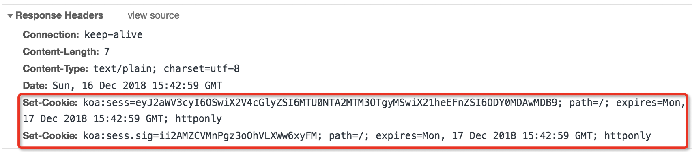

# 从 koa-session 源码解读 session 本质 

## 前言

> Session，又称为“会话控制”，存储特定用户会话所需的属性及配置信息。存于服务器，在整个用户会话中一直存在。

然而：

- session 到底是什么？
- session 是存在服务器内存里，还是web服务器原生支持？
- http请求是无状态的，为什么每次服务器能取到你的 session 呢？
- 关闭浏览器会过期吗？

本文将从 `koa-session（koa官方维护的session中间件）` 的源码详细解读 session 的机制原理。希望大家读完后，会对 session 的本质，以及 session 和 cookie 的区别有个更清晰的认识。

## 基础知识

相信大家都知道一些关于 cookie 和 session 的概念，最通常的解释是 cookie 存于浏览器，session 存于服务器。

cookie 是由浏览器支持，并且http请求会在请求头中携带 cookie 给服务器。也就是说，浏览器每次访问页面，服务器都能获取到这次访问者的 cookie 。



但对于 session 存在服务器哪里，以及服务器是通过什么对应到本次访问者的 session ，其实问过一些后端同学，解释得也都比较模糊。因为一般都是服务框架自带就有这功能，都是直接用。背后的原理是什么，并不一定会去关注。

如果我们使用过koa框架，就知道koa自身是无法使用 session 的，这就似乎说明了 session 并不是服务器原生支持，必须由 koa-session 中间件去支持实现。

那它到底是怎么个实现机制呢，接下来我们就进入源码解读。

## 源码解读

koa-session：https://github.com/koajs/session

> 建议感兴趣的同学可以下载代码先看一眼
>
> 解读过程中贴出的代码，部分有精简

### koa-session结构

来看 koa-session 的目录结构，非常简单；主要逻辑集中在 context.js 。

```
├── index.js    // 入口
├── lib
│   ├── context.js
│   ├── session.js
│   └── util.js
└── package.json
```

先给出一个 koa-session 主要模块的脑图，可以先看个大概：


### 屡一下流程

我们从 koa-session 的初始化，来一步步看下它的执行流程：

先看下 koa-sessin 的使用方法：

```javascript
const session = require('koa-session');
const Koa = require('koa');
const app = new Koa();

app.keys = ['some secret hurr'];
const CONFIG = {
  key: 'koa:sess',  // 默认值，自定义cookie中的key
  maxAge: 86400000
};

app.use(session(CONFIG, app));  // 初始化koa-session中间件

app.use(ctx => {
  let n = ctx.session.views || 0;   // 每次都可以取到当前用户的session
  ctx.session.views = ++n;
  ctx.body = n + ' views';
});

app.listen(3000);
```

#### 初始化

初始化 koa-session 时，会要求传入一个app实例。

实际上，正是在初始化的时候，往 app.context 上挂载了session对象，并且 session 对象是由 `lib/context.js` 实例化而来，所以我们使用的 ctx.session 就是 koa-session 自己构造的一个类。

我们打开`koa-session/index.js`：

```javascript
module.exports = function(opts, app) {
  opts = formatOpts(opts);  // 格式化配置项，设置一些默认值
  extendContext(app.context, opts); // 划重点，给 app.ctx 定义了 session对象

  return async function session(ctx, next) {
    const sess = ctx[CONTEXT_SESSION];
    if (sess.store) await sess.initFromExternal();
    await next();
    if (opts.autoCommit) {
      await sess.commit();
    }
  };
};
```

通过内部的一次初始化，返回一个koa中间件函数。

一步一步的来看，formatOpts 是用来做一些默认参数处理，extendContext 的主要任务是对 ctx 做一个拦截器，如下：

```javascript
function extendContext(context, opts) {
  Object.defineProperties(context, {
    [CONTEXT_SESSION]: {
      get() {
        if (this[_CONTEXT_SESSION]) return this[_CONTEXT_SESSION];
        this[_CONTEXT_SESSION] = new ContextSession(this, opts);
        return this[_CONTEXT_SESSION];
      },
    },
    session: {
      get() {
        return this[CONTEXT_SESSION].get();
      },
      set(val) {
        this[CONTEXT_SESSION].set(val);
      },
      configurable: true,
    }
  });
}
```

走到上面这段代码时，事实上就是给 app.context 下挂载了一个“私有”的 ContextSession 对象 `ctx[CONTEXT_SESSION]` ，有一些方法用来初始化它（如initFromExternal、initFromCookie）。然后又挂载了一个“公共”的 session 对象。

为什么说到“私有”、“公共”呢，这里比较细节。用到了 Symbol 类型，使得外部不可访问到 `ctx[CONTEXT_SESSION]` 。只通过 `ctx.session` 对外暴露了 (get/set) 方法。

再来看下 `index.js` 导出的中间件函数

```javascript
return async function session(ctx, next) {
  const sess = ctx[CONTEXT_SESSION];
  if (sess.store) await sess.initFromExternal();
  await next();
  if (opts.autoCommit) {
    await sess.commit();
  }
};
```

这里，将 `ctx[CONTEXT_SESSION]` 实例赋值给了 sess ，然后根据是否有 opts.store ，调用了 `sess.initFromExternal` ，字面意思是每次经过中间件，都会去调一个外部的东西来初始化 session ，我们后面会提到。

接着看是执行了如下代码，也即执行我们的业务逻辑。

```javascript
await next()
```

然后就是下面这个了，看样子应该是类似保存 session 的操作。

```javascript
sess.commit();
```

经过上面的代码分析，我们看到了 `koa-session` 中间件的主流程以及保存操作。

那么 session 在什么时候被创建呢？回到上面提到的拦截器 `extendContext` ，它会在接到http请求的时候，从 `ContextSession类` 实例化出 session 对象。

> 也就是说，session 是中间件自己创建并管理的，并非由web服务器产生。

我们接着看核心功能 `ContextSession` 。

#### ContextSession类

先看构造函数：

```javascript
constructor(ctx, opts) {
  this.ctx = ctx;
  this.app = ctx.app;
  this.opts = Object.assign({}, opts);
  this.store = this.opts.ContextStore ? new this.opts.ContextStore(ctx) : this.opts.store;
}
```

居然啥屁事都没干。往下看 `get()` 方法:

```javascript
get() {
  const session = this.session;
  // already retrieved
  if (session) return session;
  
  // unset
  if (session === false) return null;

  // cookie session store
  if (!this.store) this.initFromCookie();
  return this.session;
}
```

噢，原来是一个单例模式（等到使用时候再生成对象，多次调用会直接使用第一次的对象）。

这里有个判断，是否传入了 opts.store 参数，如果没有则是用 `initFromCookie()` 来生成 session 对象。

那如果传了 opts.store 呢，又啥都不干吗，WTF？

显然不是，还记得初始化里提到的那句 `initFromExternal` 函数调用么。

```javascript
if (sess.store) await sess.initFromExternal();
```

所以，这里是根据是否有 opts.store ，来选择两种方式不同的生成 session 方式。

> 问：store是什么呢？
>
> 答：store可以在`initFromExternal`中看到，它其实是一个外部存储。
>
> 问：什么外部存储，存哪里的？
>
> 答：同学莫急，先往后看。

##### initFromCookie

```javascript
initFromCookie() {
  const ctx = this.ctx;
  const opts = this.opts;

  const cookie = ctx.cookies.get(opts.key, opts);
  if (!cookie) {  
    this.create();
    return;
  }

  let json = opts.decode(cookie); // 打印json的话，会发现居然就是你的session对象！

  if (!this.valid(json)) {  // 判断cookie过期等
    this.create();
    return;
  }

  this.create(json);
}
```

在这里，我们发现了一个很重要的信息，session 居然是加密后直接存在 cookie 中的。

我们 `console.log` 一下 `json` 变量，来验证下：


##### initFromeExternal

```javascript
async initFromExternal() {
  const ctx = this.ctx;
  const opts = this.opts;

  let externalKey;
  if (opts.externalKey) {
    externalKey = opts.externalKey.get(ctx);
  } else {
    externalKey = ctx.cookies.get(opts.key, opts);
  }


  if (!externalKey) {
    // create a new `externalKey`
    this.create();
    return;
  }

  const json = await this.store.get(externalKey, opts.maxAge, { rolling: opts.rolling });
  if (!this.valid(json, externalKey)) {
    // create a new `externalKey`
    this.create();
    return;
  }

  // create with original `externalKey`
  this.create(json, externalKey);
}
```

可以看到 `store.get()` ，有一串信息是存在 store 中，可以 get 到的。

而且也是在不断地要求调用 `create()` 。

##### create

`create()`到底做了什么呢？

```javascript
create(val, externalKey) {
  if (this.store) this.externalKey = externalKey || this.opts.genid();
  this.session = new Session(this, val);
}
```

它判断了 store ，如果有 store ，就会设置上 `externalKey` ，或者生成一个随机id。

基本可以看出，是在 sotre 中存储一些信息，并且可以通过 externalKey 去用来获取。

> 由此基本得出推断，session 并不是服务器原生支持，而是由web服务程序自己创建管理。
>
> 存放在哪里呢？不一定要在服务器，可以像 koa-session 一样骚气地放在 cookie 中！

接着看最后一个 Session 类。

#### Session类

老规矩，先看构造函数：

```javascript
constructor(sessionContext, obj) {
  this._sessCtx = sessionContext;
  this._ctx = sessionContext.ctx;
  if (!obj) {
    this.isNew = true;
  } else {
    for (const k in obj) {
      // restore maxAge from store
      if (k === '_maxAge') this._ctx.sessionOptions.maxAge = obj._maxAge;
      else if (k === '_session') this._ctx.sessionOptions.maxAge = 'session';
      else this[k] = obj[k];
    }
  }
}
```

接收了 ContextSession 实例传来 sessionContext 和 obj ，其他没有做什么。

Session 类仅仅是用于存储 session 的值，以及_maxAge，并且提供了toJSON方法用来获取过滤了_maxAge等字段的，session对象的值。

#### session如何持久化保存

看完以上代码，我们大致知道了 session 可以从外部或者 cookie 中取值，那它是如何保存的呢，我们回到 `koa-session/index.js` 中提到的 `commit` 方法，可以看到：

```javascript
await next();

if (opts.autoCommit) {
  await sess.commit();
}
```

思路立马就清晰了，它是在中间件结束 `next()` 后，进行了一次 `commit()` 。

`commit()`方法，可以在 `lib/context.js` 中找到：

```javascript
async commit() {
  // ...省略n个判断，包括是否有变更，是否需要删除session等

  await this.save(changed);
}
```

再来看`save()`方法：

```javascript
async save(changed) {
  const opts = this.opts;
  const key = opts.key;
  const externalKey = this.externalKey;
  let json = this.session.toJSON();

  // save to external store
  if (externalKey) {
    await this.store.set(externalKey, json, maxAge, {
      changed,
      rolling: opts.rolling,
    });
    if (opts.externalKey) {
      opts.externalKey.set(this.ctx, externalKey);
    } else {
      this.ctx.cookies.set(key, externalKey, opts);
    }
    return;
  }

  json = opts.encode(json);

  this.ctx.cookies.set(key, json, opts);
}
```

豁然开朗了，实际就是默认把数据 json ，塞进了 cookie ，即 cookie 来存储加密后的 session 信息。

然后，如果设置了外部 store ，会调用 `store.set()` 去保存 session 。具体的保存逻辑，保存到哪里，由 store 对象自己决定！

#### 小结

koa-session 的做法说明了，session 仅仅是一个对象信息，可以存到 cookie ，也可以存到任何地方（如内存，数据库）。存到哪，可以开发者自己决定，只要实现一个 store 对象，提供 set，get 方法即可。

### 延伸扩展

通过以上源码分析，我们已经得到了我们文章开头那些疑问的答案。

koa-session 中还有哪些值得我们思考呢？

#### 插件设计

不得不说，store 的插件式设计非常优秀。koa-session 不必关心数据具体是如何存储的，只要插件提供它所需的存取方法。

这种插件式架构，反转了模块间的依赖关系，使得 koa-session 非常容易扩展。

#### koa-session对安全的考虑

这种默认把用户信息存储在 cookie 中的方式，始终是不安全的。

所以，现在我们知道使用的时候要做一些其他措施了。比如实现自己的 store ，把 session 存到 redis 等。

#### 这种session的登录方式，和token有什么区别呢

这其实要从 token 的使用方式来说了，用途会更灵活，这里就先不多说了。

后面会写一下各种登录策略的原理和比较，有兴趣的同学可以关注我一下。

## 总结

回顾下文章开头的几个问题，我们已经有了明确的答案。

- session 是一个概念，是一个数据对象，用来存储访问者的信息。
- session 的存储方式由开发者自己定义，可存于内存，redis，mysql，甚至是 cookie 中。
- 用户第一次访问的时候，我们就会给用户创建一个他的 session ，并在 cookie 中塞一个他的 “钥匙key” 。所以即使 http请求 是无状态的，但通过 cookie 我们就可以拿到访问者的 “钥匙key” ，便可以从所有访问者的 session 集合中取出对应访问者的 session。
- 关闭浏览器，服务端的 session 是不会马上过期的。session 中间件自己实现了一套管理方式，当访问间隔超过 maxAge 的时候，session 便会失效。

那么除了 koa-session 这种方式来实现用户登录，还有其他方法吗？

其实还有很多，可以存储 cookie 实现，也可以用 token 方式。另外关于登录还有单点登录，第三方登录等。如果大家有兴趣，可以在后面的文章继续给大家剖析。